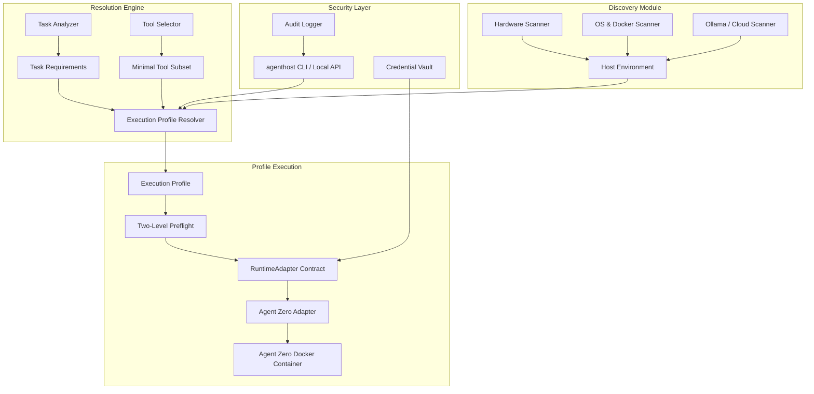

# AgentHost Dependency & Data Flow Map

```mermaid
graph TD
    CLI[agenthost CLI / Local API] --> Resolver[Execution Profile Resolver]
    
    subgraph Discovery Module
        HW[Hardware Scanner] --> Env[Host Environment]
        OS[OS & Docker Scanner] --> Env
        ModelDisc[Ollama / Cloud Scanner] --> Env
    end

    subgraph Resolution Engine
        TA[Task Analyzer] --> Req[Task Requirements]
        TS[Tool Selector] --> Tools[Minimal Tool Subset]
        Req --> Resolver
        Tools --> Resolver
        Env --> Resolver
    end

    subgraph Profile Execution
        Resolver --> EP[Execution Profile]
        EP --> Preflight[Two-Level Preflight]
        Preflight --> Adapter[RuntimeAdapter Contract]
        Adapter --> A0[Agent Zero Adapter]
        A0 --> Docker[Agent Zero Docker Container]
    end

    subgraph Security Layer
        Vault[Credential Vault] --> Adapter
        Audit[Audit Logger] --> CLI
    end
```
