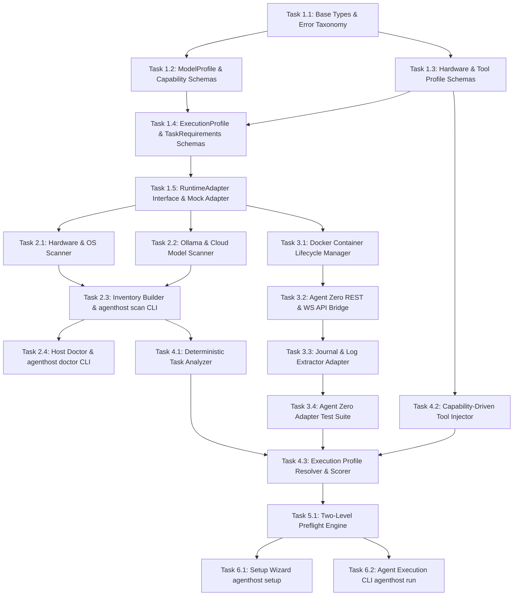

# AgentHost Implementation DAG & Sprint Specification

This document defines the complete **Directed Acyclic Graph (DAG)** of implementation tasks for the **AgentHost v0.1** daemon. Each node specifies explicit prerequisites, inputs, deliverables, validation criteria, and error handling rules so coding agents can execute implementation without ambiguity.

---

## 1. Topological DAG Overview

---

## 2. Sprint & Task Breakdown

### SPRINT 1: Core Domain Schemas & Contracts (Phase 0)

#### Task 1.1: Error Taxonomy & Base Types
- **Task ID**: `TASK-1.1`
- **Prerequisites**: None
- **Inputs**: [01-coding-standards.md](file:///f:/Playgrounds/alamia-personal-ai/.ai/permanent/standards/01-coding-standards.md)
- **Deliverables**:
  - `src/domain/errors.py` (or `src/domain/errors.ts`): Standard error hierarchy inheriting from `AgentHostError`.
  - Error classes: `DiscoveryError`, `ConfigurationError`, `PreflightFailedError`, `RuntimeUnavailableError`, `ModelUnavailableError`, `CapabilityMismatchError`, `QuotaExceededError`, `RuntimeError`.
- **Validation Criteria**:
  - Unit tests verifying exception instantiation with diagnostic details, error codes, and message formatting.

#### Task 1.2: ModelProfile & Capability Schemas
- **Task ID**: `TASK-1.2`
- **Prerequisites**: `TASK-1.1`
- **Inputs**: [01-system-architecture.md](file:///f:/Playgrounds/alamia-personal-ai/.ai/permanent/architecture/01-system-architecture.md), `artifacts/model-profiles.json`
- **Deliverables**:
  - `src/domain/schemas/model.py`: `ModelProfile`, `ProviderInfo`, `HardwareRequirements`, `Capabilities`, `Economics`, `Limits`, `Evidence` schemas.
  - `src/domain/scoring.py`: Formula implementation:
    $$\text{effective\_capability} = \text{capability\_score} \times \text{evidence\_confidence}$$
- **Validation Criteria**:
  - Validates `artifacts/model-profiles.json` fixture against schema.
  - Unit tests verifying confidence score calculations across vendor (0.40), community (0.55), benchmark (0.90), and empirical (0.98) sources.

#### Task 1.3: Hardware & Tool Profile Schemas
- **Task ID**: `TASK-1.3`
- **Prerequisites**: `TASK-1.1`
- **Inputs**: [01-system-architecture.md](file:///f:/Playgrounds/alamia-personal-ai/.ai/permanent/architecture/01-system-architecture.md), `artifacts/environment-report.json`
- **Deliverables**:
  - `src/domain/schemas/hardware.py`: `HardwareProfile` (CPU, RAM, GPU model, VRAM headroom, disk space).
  - `src/domain/schemas/tool.py`: `ToolProfile` (tool ID, capability requirements, prompt footprint tokens).
- **Validation Criteria**:
  - Validates `artifacts/environment-report.json` fixture against schema.

#### Task 1.4: ExecutionProfile & TaskRequirements Schemas
- **Task ID**: `TASK-1.4`
- **Prerequisites**: `TASK-1.2`, `TASK-1.3`
- **Inputs**: [feedback-03.md](file:///f:/Playgrounds/alamia-personal-ai/docs/feedback/feedback-03.md)
- **Deliverables**:
  - `src/domain/schemas/execution.py`: Composite `ExecutionProfile` schema representing $(Runtime, Model, Hardware, Tools, Mode)$.
  - `src/domain/schemas/task.py`: `TaskRequirements` schema representing boolean task flags (`browser`, `filesystem`, `code_execution`, `long_context`, `vision`, `cloud_allowed`, `privacy_constraint`).
- **Validation Criteria**:
  - Serialization / deserialization unit tests for local, cloud, and hybrid execution profiles.

#### Task 1.5: RuntimeAdapter Interface & Mock Adapter
- **Task ID**: `TASK-1.5`
- **Prerequisites**: `TASK-1.4`
- **Inputs**: [agenthost-plan.md Section 3](file:///f:/Playgrounds/alamia-personal-ai/docs/agenthost-plan.md)
- **Deliverables**:
  - `src/domain/contract/runtime_adapter.py`: Abstract `RuntimeAdapter` interface definition (`discover`, `install`, `configure`, `start`, `stop`, `restart`, `health`, `capabilities`, `models`, `execute`, `stream`, `cancel`, `logs`, `diagnostics`).
  - `src/testing/mock_adapter.py`: In-memory mock implementation for testing downstream modules.
- **Validation Criteria**:
  - Contract test suite passing against `MockAdapter`.

---

### SPRINT 2: Host Discovery Engine (Phase 1)

#### Task 2.1: Hardware & OS Scanner
- **Task ID**: `TASK-2.1`
- **Prerequisites**: `TASK-1.5`
- **Inputs**: Windows WMI / PyNVML / system queries
- **Deliverables**:
  - `src/discovery/hardware_scanner.py`: Inspects CPU cores, physical RAM, GPU VRAM, CUDA capability, and disk space.
  - `src/discovery/os_scanner.py`: Inspects Windows version, WSL status, Docker daemon ping, and PATH binary locations.
- **Validation Criteria**:
  - Returns structured `HardwareProfile` matching local host properties without throwing unhandled exceptions when GPU/Docker is missing.

#### Task 2.2: Ollama & Cloud Model Scanner
- **Task ID**: `TASK-2.2`
- **Prerequisites**: `TASK-1.5`
- **Inputs**: Local Ollama HTTP API (`http://localhost:11434/api/tags`), API environment keys
- **Deliverables**:
  - `src/discovery/model_scanner.py`: Scans local Ollama models and checks cloud provider credentials (Groq / OpenRouter).
- **Validation Criteria**:
  - Returns list of `ModelProfile` instances with appropriate evidence source tags.

#### Task 2.3: Host Inventory Builder & `agenthost scan` CLI
- **Task ID**: `TASK-2.3`
- **Prerequisites**: `TASK-2.1`, `TASK-2.2`
- **Inputs**: Discovery module outputs
- **Deliverables**:
  - `src/discovery/inventory.py`: Merges hardware, OS, runtime, and model scans into unified `HostInventory`.
  - `src/cli/scan.py`: Command `agenthost scan` outputting formatted summary or JSON report (`artifacts/environment-report.json`).
- **Validation Criteria**:
  - Running `agenthost scan` produces schema-valid inventory output within 3 seconds.

#### Task 2.4: Host Doctor & `agenthost doctor` CLI
- **Task ID**: `TASK-2.4`
- **Prerequisites**: `TASK-2.3`
- **Deliverables**:
  - `src/cli/doctor.py`: Command `agenthost doctor` checking prerequisites (Docker socket access, VRAM thresholds, Ollama service state) with actionable diagnostic recommendations.
- **Validation Criteria**:
  - Formats diagnostic checks with pass/fail/warning indicators.

---

### SPRINT 3: Agent Zero Runtime Adapter (Phase 2)

#### Task 3.1: Docker Container Lifecycle Manager
- **Task ID**: `TASK-3.1`
- **Prerequisites**: `TASK-1.5`
- **Inputs**: Docker API / SDK, Agent Zero v2.8 image spec
- **Deliverables**:
  - `src/adapters/agent_zero/container.py`: Manages Docker container creation, named volumes, port binding (`127.0.0.1`), start, stop, restart, and health checks.
- **Validation Criteria**:
  - Safe volume mounting, automated health check polling, cleanup on termination.

#### Task 3.2: Agent Zero REST & Socket.io API Bridge
- **Task ID**: `TASK-3.2`
- **Prerequisites**: `TASK-3.1`
- **Inputs**: Agent Zero v2.8 API endpoints (`/api/api_message`) and socket.io events
- **Deliverables**:
  - `src/adapters/agent_zero/api_bridge.py`: Handles message dispatch, session state, and Socket.io event streaming.
- **Validation Criteria**:
  - Submits test prompt via REST and streams turns cleanly over WebSocket bridge.

#### Task 3.3: Journal & Log Extractor Adapter
- **Task ID**: `TASK-3.3`
- **Prerequisites**: `TASK-3.2`
- **Inputs**: Agent Zero log endpoint (`/api/api_log_get`)
- **Deliverables**:
  - `src/adapters/agent_zero/journal.py`: Extracts turn-by-turn logs, tool invocation outputs, and error state logs.
- **Validation Criteria**:
  - Formats raw runtime logs into standardized `Journal` structures.

#### Task 3.4: Agent Zero Adapter Integration Test Suite
- **Task ID**: `TASK-3.4`
- **Prerequisites**: `TASK-3.3`
- **Deliverables**:
  - `tests/integration/test_agent_zero_adapter.py`: Verification suite covering complete `RuntimeAdapter` protocol compliance.
- **Validation Criteria**:
  - 100% test pass rate for `discover`, `start`, `health`, `execute`, `logs`, `stop`.

---

### SPRINT 4: Task Analyzer & Execution Profile Resolver (Phases 3 & 4)

#### Task 4.1: Deterministic Task Analyzer
- **Task ID**: `TASK-4.1`
- **Prerequisites**: `TASK-2.3`
- **Inputs**: Task text strings
- **Deliverables**:
  - `src/resolution/task_analyzer.py`: Rules-based classifier converting user tasks into `TaskRequirements`.
- **Validation Criteria**:
  - Accurately classifies requirements for file ops, browser tasks, coding tasks, and privacy constraints.

#### Task 4.2: Capability-Driven Tool Injector
- **Task ID**: `TASK-4.2`
- **Prerequisites**: `TASK-1.3`
- **Inputs**: `TaskRequirements`, tool catalog
- **Deliverables**:
  - `src/resolution/tool_selector.py`: Filters total tool catalog down to the minimal subset matching task requirements.
- **Validation Criteria**:
  - Task "Summarize PDF" includes filesystem tools and excludes browser/shell tools, reducing prompt overhead.

#### Task 4.3: Execution Profile Resolver & Scorer
- **Task ID**: `TASK-4.3`
- **Prerequisites**: `TASK-4.1`, `TASK-4.2`, `TASK-3.4`
- **Inputs**: `HostInventory`, candidate runtimes, model profiles, task requirements
- **Deliverables**:
  - `src/resolution/resolver.py`: Composite resolver ranking candidate profiles based on hardware fit, capability scores, cost, privacy, and reliability. Outputs explicit human-readable rationale.
- **Validation Criteria**:
  - Deterministic and reproducible scoring across benchmark inputs with zero randomness.

---

### SPRINT 5: Two-Level Preflight Engine (Phase 5)

#### Task 5.1: Two-Level Preflight Engine
- **Task ID**: `TASK-5.1`
- **Prerequisites**: `TASK-4.3`
- **Deliverables**:
  - `src/resolution/preflight.py`:
    - `ProfilePreflight`: Deep validation of runtime image, VRAM capacity, model availability, and security settings.
    - `TaskPreflight`: Rapid per-request check for capability compatibility, quota limits, and token budgets.
- **Validation Criteria**:
  - Profile preflight catches missing dependencies; task preflight executes in $<5\text{ms}$.

---

### SPRINT 6: User CLI UX & Execution Interface (Phase 6)

#### Task 6.1: Setup Wizard (`agenthost setup`)
- **Task ID**: `TASK-6.1`
- **Prerequisites**: `TASK-5.1`
- **Deliverables**:
  - `src/cli/setup.py`: `agenthost setup` interactive wizard running scan $\rightarrow$ resolve profile $\rightarrow$ preflight $\rightarrow$ configure container.
- **Validation Criteria**:
  - Displays explainable recommendation card and completes setup smoothly upon user acceptance.

#### Task 6.2: Execution CLI (`agenthost run`)
- **Task ID**: `TASK-6.2`
- **Prerequisites**: `TASK-5.1`
- **Deliverables**:
  - `src/cli/run.py`: `agenthost run "task description"` executing task through resolved runtime profile with live streaming output.
- **Validation Criteria**:
  - End-to-end task completion with clean user-facing feedback.

---

## 3. Implementation Matrix Summary

| Task ID | Task Name | Prerequisites | Priority | Target Module |
|---|---|---|---|---|
| `TASK-1.1` | Error Taxonomy & Base Types | None | P0 | `src/domain/errors` |
| `TASK-1.2` | ModelProfile & Capability Schemas | `TASK-1.1` | P0 | `src/domain/schemas/model` |
| `TASK-1.3` | Hardware & Tool Profile Schemas | `TASK-1.1` | P0 | `src/domain/schemas/hardware` |
| `TASK-1.4` | ExecutionProfile & TaskRequirements | `TASK-1.2`, `TASK-1.3` | P0 | `src/domain/schemas/execution` |
| `TASK-1.5` | RuntimeAdapter Interface & Mock | `TASK-1.4` | P0 | `src/domain/contract/runtime_adapter` |
| `TASK-2.1` | Hardware & OS Scanner | `TASK-1.5` | P1 | `src/discovery/hardware_scanner` |
| `TASK-2.2` | Model Discovery Scanner | `TASK-1.5` | P1 | `src/discovery/model_scanner` |
| `TASK-2.3` | Host Inventory & `agenthost scan` | `TASK-2.1`, `TASK-2.2` | P1 | `src/cli/scan` |
| `TASK-2.4` | Host Doctor & `agenthost doctor` | `TASK-2.3` | P1 | `src/cli/doctor` |
| `TASK-3.1` | Docker Lifecycle Manager | `TASK-1.5` | P1 | `src/adapters/agent_zero/container` |
| `TASK-3.2` | REST & WS API Bridge | `TASK-3.1` | P1 | `src/adapters/agent_zero/api_bridge` |
| `TASK-3.3` | Journal & Log Extractor | `TASK-3.2` | P1 | `src/adapters/agent_zero/journal` |
| `TASK-3.4` | Agent Zero Adapter Test Suite | `TASK-3.3` | P1 | `tests/integration/test_agent_zero_adapter` |
| `TASK-4.1` | Deterministic Task Analyzer | `TASK-2.3` | P2 | `src/resolution/task_analyzer` |
| `TASK-4.2` | Capability-Driven Tool Injector | `TASK-1.3` | P2 | `src/resolution/tool_selector` |
| `TASK-4.3` | Execution Profile Resolver | `TASK-4.1`, `TASK-4.2`, `TASK-3.4` | P2 | `src/resolution/resolver` |
| `TASK-5.1` | Two-Level Preflight Engine | `TASK-4.3` | P2 | `src/resolution/preflight` |
| `TASK-6.1` | Setup Wizard (`agenthost setup`) | `TASK-5.1` | P3 | `src/cli/setup` |
| `TASK-6.2` | Agent Execution CLI (`agenthost run`) | `TASK-5.1` | P3 | `src/cli/run` |
