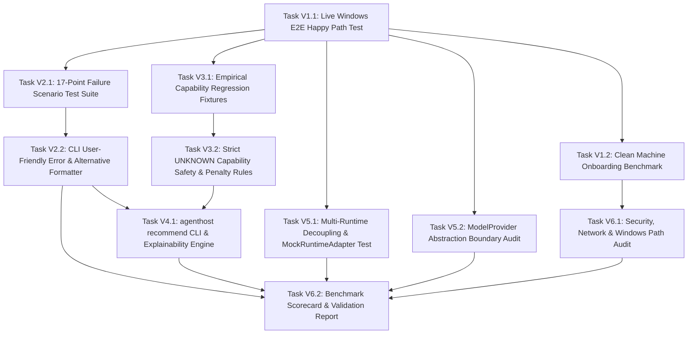

# AgentHost v0.1 Product Validation & Hardening DAG Specification

This document defines the **Directed Acyclic Graph (DAG)** and Sprint breakdown for the **v0.1 Product Validation & Hardening** phase of **AgentHost**, derived directly from [feedback-04-product-validation-DAG.md](file:///f:/Playgrounds/alamia-personal-ai/docs/feedback/feedback-04-product-validation-DAG.md).

The goal of this phase is **NOT** to add new product features, but to rigorously test, harden, decouple, and benchmark the existing implementation.

---

## 1. Topological DAG Overview

---

## 2. Sprint & Task Breakdown

### SPRINT V1: E2E Happy Path & Onboarding Validation

#### Task V1.1: Live Windows E2E Happy Path Test
- **Task ID**: `TASK-V1.1`
- **Prerequisites**: Existing TASK-1 through TASK-6 implementations.
- **Inputs**: [feedback-04-product-validation-DAG.md Section 1](file:///f:/Playgrounds/alamia-personal-ai/docs/feedback/feedback-04-product-validation-DAG.md)
- **Deliverables**:
  - `tests/e2e/test_happy_path_live.py`: Automated E2E integration test verifying complete flow on host:
    `agenthost setup` $\rightarrow$ `scan` $\rightarrow$ `discover hardware` $\rightarrow$ `discover Ollama` $\rightarrow$ `discover Agent Zero` $\rightarrow$ `resolve profile` $\rightarrow$ `preflight` $\rightarrow$ `agenthost run` $\rightarrow$ `Agent Zero execution` $\rightarrow$ `result`.
- **Validation Criteria**:
  - 100% pass rate on live host environment with Docker and Ollama running.

#### Task V1.2: Clean Machine Onboarding Benchmark
- **Task ID**: `TASK-V1.2`
- **Prerequisites**: `TASK-V1.1`
- **Inputs**: [feedback-04-product-validation-DAG.md Section 3](file:///f:/Playgrounds/alamia-personal-ai/docs/feedback/feedback-04-product-validation-DAG.md)
- **Deliverables**:
  - `tests/e2e/test_clean_onboarding.py`: Test suite simulating first-time user initialization without pre-existing configuration.
- **Validation Criteria**:
  - Onboarding workflow finishes in <5 minutes with zero manual file edits required.

---

### SPRINT V2: Failure-Path Hardening & Friendly Error Formatting

#### Task V2.1: 17-Point Failure Scenario Test Suite
- **Task ID**: `TASK-V2.1`
- **Prerequisites**: `TASK-V1.1`
- **Inputs**: [feedback-04-product-validation-DAG.md Section 2](file:///f:/Playgrounds/alamia-personal-ai/docs/feedback/feedback-04-product-validation-DAG.md)
- **Deliverables**:
  - `tests/integration/test_failure_paths.py`: Test suite covering 17 failure modes:
    1. Docker missing / stopped
    2. Ollama offline
    3. Agent Zero container missing / stopped
    4. Invalid API keys
    5. Model unavailable
    6. VRAM limit exceeded
    7. Insufficient System RAM
    8. No compatible model found
    9. Provider API down
    10. TPM quota exceeded
    11. Required capability unavailable
    12. Tool injection failure
    13. Agent Zero REST API failure
    14. WebSocket connection failure
    15. Port collision
    16. Interrupted setup process
    17. Invalid/corrupted config
- **Validation Criteria**:
  - All 17 failure scenarios caught gracefully without unhandled Python stack traces (`Traceback...`).

#### Task V2.2: CLI User-Friendly Error & Alternative Recommender
- **Task ID**: `TASK-V2.2`
- **Prerequisites**: `TASK-V2.1`
- **Inputs**: [feedback-04-product-validation-DAG.md Section 2](file:///f:/Playgrounds/alamia-personal-ai/docs/feedback/feedback-04-product-validation-DAG.md)
- **Deliverables**:
  - `src/cli/formatter.py`: Error formatting utility converting `AgentHostError` into structured output:
    - Root Cause Analysis
    - Available Alternatives
    - Recommended action prompt (`Run alternative? [Y/n]`).
- **Validation Criteria**:
  - 100% of CLI error outputs match user-friendly formatted schema.

---

### SPRINT V3: Empirical Evidence Fixtures & Capability Safety

#### Task V3.1: Empirical Capability Regression Fixtures
- **Task ID**: `TASK-V3.1`
- **Prerequisites**: `TASK-V1.1`
- **Inputs**: [feedback-04-product-validation-DAG.md Section 4](file:///f:/Playgrounds/alamia-personal-ai/docs/feedback/feedback-04-product-validation-DAG.md)
- **Deliverables**:
  - `tests/fixtures/empirical_capabilities.json`: Fixtures for known model behaviors (Qwen 7B/14B multi-tool limitations, Llama 3.3 70B TPM limits, DeepSeek 14B unknown status).
  - `tests/unit/test_resolver_fixtures.py`: Regression tests asserting AgentHost never recommends an execution profile with explicitly unsupported capabilities.
- **Validation Criteria**:
  - Zero false-positive recommendations for models with known capability failures.

#### Task V3.2: Strict UNKNOWN Capability Safety & Penalty Rules
- **Task ID**: `TASK-V3.2`
- **Prerequisites**: `TASK-V3.1`
- **Inputs**: [feedback-04-product-validation-DAG.md Section 5](file:///f:/Playgrounds/alamia-personal-ai/docs/feedback/feedback-04-product-validation-DAG.md)
- **Deliverables**:
  - Update `src/domain/scoring.py` and `src/resolution/resolver.py`: Enforce strict penalty for `UNKNOWN` capabilities ($\text{confidence} \le 0.40$), returning `⚠ Capability not verified` and prompt option to run a capability test.
- **Validation Criteria**:
  - `UNKNOWN` capability status never converts to implicit `SUPPORTED`.

---

### SPRINT V4: Explainable Recommendation Engine

#### Task V4.1: `agenthost recommend` CLI & Explainability Engine
- **Task ID**: `TASK-V4.1`
- **Prerequisites**: `TASK-V2.2`, `TASK-V3.2`
- **Inputs**: [feedback-04-product-validation-DAG.md Section 6](file:///f:/Playgrounds/alamia-personal-ai/docs/feedback/feedback-04-product-validation-DAG.md)
- **Deliverables**:
  - `src/cli/recommend.py`: `agenthost recommend` command displaying structured decision breakdown:
    - Selected Runtime & Version
    - Selected Model & Provider
    - Execution Mode (Local / Cloud / Hybrid)
    - Detailed *Why?* breakdown ($\checkmark$ Hardware, $\checkmark$ Runtime, $\checkmark$ Model, $\triangle$ Capabilities)
    - Ranked Alternatives
    - Overall Confidence Score (%)
    - Estimated Costs ($/1M tokens)
- **Validation Criteria**:
  - Command executes in <3 seconds and outputs structured human-readable breakdown.

---

### SPRINT V5: Architectural Boundary & Decoupling Audit

#### Task V5.1: Multi-Runtime Decoupling & MockRuntimeAdapter Test
- **Task ID**: `TASK-V5.1`
- **Prerequisites**: `TASK-V1.1`
- **Inputs**: [feedback-04-product-validation-DAG.md Section 7](file:///f:/Playgrounds/alamia-personal-ai/docs/feedback/feedback-04-product-validation-DAG.md)
- **Deliverables**:
  - `src/domain/contract/registry.py`: Dynamic runtime adapter registry.
  - `tests/unit/test_runtime_decoupling.py`: Unit test proving new `MockRuntimeAdapter` (simulating a secondary runtime like OpenJarvis) registers and resolves without modifying `ExecutionProfileResolver`.
- **Validation Criteria**:
  - 0 lines of code changed in `src/resolution/resolver.py` when registering a secondary runtime.

#### Task V5.2: ModelProvider Abstraction Boundary Audit
- **Task ID**: `TASK-V5.2`
- **Prerequisites**: `TASK-V1.1`
- **Inputs**: [feedback-04-product-validation-DAG.md Section 8](file:///f:/Playgrounds/alamia-personal-ai/docs/feedback/feedback-04-product-validation-DAG.md)
- **Deliverables**:
  - `src/domain/contract/model_provider.py`: Abstract `ModelProvider` class (`discover()`, `models()`, `health()`, `limits()`).
  - Refactor `src/discovery/model_scanner.py` to use `ModelProvider` registry.
- **Validation Criteria**:
  - Provider adapters (Ollama, Groq, OpenRouter) plug into model scanner cleanly behind abstract interface.

---

### SPRINT V6: System Audit, Scorecard & Validation Report

#### Task V6.1: Security, Network & Windows Path Audit
- **Task ID**: `TASK-V6.1`
- **Prerequisites**: `TASK-V1.2`
- **Inputs**: [feedback-04-product-validation-DAG.md Section 14-15](file:///f:/Playgrounds/alamia-personal-ai/docs/feedback/feedback-04-product-validation-DAG.md)
- **Deliverables**:
  - Audit report & fixes:
    - Default local network binding (`127.0.0.1`)
    - Environment variables & API secrets handling
    - Docker command execution security
    - Windows file path compatibility (`\\` vs `/`).
- **Validation Criteria**:
  - Zero hardcoded local path errors on Windows; no exposed external ports by default.

#### Task V6.2: Benchmark Scorecard & Validation Report
- **Task ID**: `TASK-V6.2`
- **Prerequisites**: `TASK-V2.2`, `TASK-V4.1`, `TASK-V5.1`, `TASK-V5.2`, `TASK-V6.1`
- **Inputs**: [feedback-04-product-validation-DAG.md Section 9, 20](file:///f:/Playgrounds/alamia-personal-ai/docs/feedback/feedback-04-product-validation-DAG.md)
- **Deliverables**:
  - `docs/agenthost-v0.1-validation-report.md`: Final validation report containing:
    - Scorecard results against targets:
      - Fresh install $\rightarrow$ setup: < 5 min
      - `agenthost scan`: < 5 sec
      - `agenthost recommend`: < 3 sec
      - Preflight checks: < 3 sec
      - Setup success rate: > 95%
      - Useful error messages: 100%
      - Unsupported capability silently selected: **0%**
      - Agent Zero core modified: **0 files**
    - Detailed test results, known limitations, resolved issues, security findings, onboarding friction, and explicit **GO / NO-GO** recommendation.
- **Validation Criteria**:
  - Report published with empirical test metrics and explicit GO/NO-GO determination.
