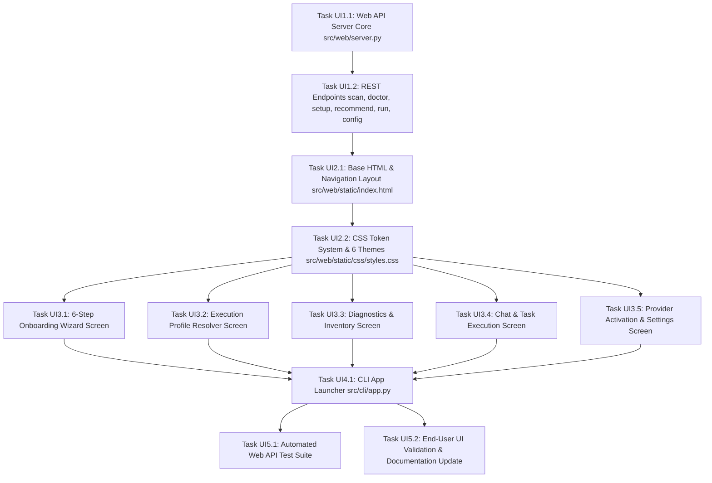

# AgentHost Web UI Implementation DAG Specification

This document defines the **Directed Acyclic Graph (DAG)** and Sprint breakdown for the **Web UI Implementation** phase of **AgentHost**, derived directly from [`docs/reference-ui.html`](file:///f:/Playgrounds/alamia-personal-ai/docs/reference-ui.html) and [`docs/implementation-kickoff.md/uiux-planing.md`](file:///f:/Playgrounds/alamia-personal-ai/docs/implementation-kickoff.md/uiux-planing.md).

The goal of this phase is to transition AgentHost from a CLI-only resolution engine into a full personal AI web application, providing a persistent home interface for chat, onboarding, model discovery, execution profile resolution, and diagnostics.

---

## 1. Topological DAG Overview

---

## 2. Sprint & Task Breakdown

### SPRINT UI1: Backend Web API Server & REST Endpoints

#### Task UI1.1: Web API Server Core
- **Task ID**: `TASK-UI1.1`
- **Prerequisites**: Existing core modules (`src/discovery`, `src/resolution`, `src/config`).
- **Inputs**: [`docs/implementation-kickoff.md/uiux-planing.md`](file:///f:/Playgrounds/alamia-personal-ai/docs/implementation-kickoff.md/uiux-planing.md)
- **Deliverables**:
  - `src/web/server.py`: Lightweight Python HTTP server implementing async/stdlib static asset serving from `src/web/static/` and JSON API routing on `http://127.0.0.1:8000`.
- **Validation Criteria**:
  - Server boots cleanly on loopback port 8000 and serves static test HTML without external dependencies.

#### Task UI1.2: AgentHost Core REST API Endpoints
- **Task ID**: `TASK-UI1.2`
- **Prerequisites**: `TASK-UI1.1`
- **Inputs**: [`src/cli/scan.py`](file:///f:/Playgrounds/alamia-personal-ai/src/cli/scan.py), [`src/cli/doctor.py`](file:///f:/Playgrounds/alamia-personal-ai/src/cli/doctor.py), [`src/cli/recommend.py`](file:///f:/Playgrounds/alamia-personal-ai/src/cli/recommend.py)
- **Deliverables**:
  - Add API route handlers in `src/web/server.py`:
    * `GET /api/scan`: Calls `InventoryBuilder().build()`, returns hardware, local models, and provider status.
    * `GET /api/doctor`: Calls `DiagnosticsInspector().run_all()`, returns health check results.
    * `POST /api/setup`: Saves mode (`local` vs `cloud`) and enabled providers to `.env`.
    * `POST /api/recommend`: Calls `ExecutionProfileResolver().resolve()`, returns resolved profile, suitability status, structural score, capability provenance, and alternatives.
    * `POST /api/run`: Calls runtime adapter execution engine.
    * `GET /api/config` / `POST /api/config`: Reads and updates user settings.
- **Validation Criteria**:
  - 100% of JSON API endpoints respond with correct schemas in <500ms.

---

### SPRINT UI2: Frontend SPA Architecture & Design Tokens

#### Task UI2.1: Base HTML & Navigation Layout
- **Task ID**: `TASK-UI2.1`
- **Prerequisites**: `TASK-UI1.2`
- **Inputs**: [`docs/reference-ui.html`](file:///f:/Playgrounds/alamia-personal-ai/docs/reference-ui.html)
- **Deliverables**:
  - `src/web/static/index.html`: Clean single-page application HTML structure containing:
    * Sidebar with desktop icon rail & mobile hamburger drawer.
    * Topbar theme swatches and title breadcrumbs.
    * Container for 7 active operational screens.
- **Validation Criteria**:
  - HTML structure matches `reference-ui.html` semantically with unique IDs for automated testing.

#### Task UI2.2: CSS Token System & 6 Theme Presets
- **Task ID**: `TASK-UI2.2`
- **Prerequisites**: `TASK-UI2.1`
- **Inputs**: [`docs/reference-ui.html`](file:///f:/Playgrounds/alamia-personal-ai/docs/reference-ui.html)
- **Deliverables**:
  - `src/web/static/css/styles.css`: CSS stylesheet implementing:
    * 6 theme presets (`nova`, `bloom`, `halftone`, `terra`, `arcade`, `ink`).
    * Flexible grid components, cards, switches, buttons, and status pills.
    * Responsive media queries for desktop, tablet, and mobile off-canvas drawer.
- **Validation Criteria**:
  - Changing `data-theme` attribute on `<html>` instantly transforms visual aesthetic across all 6 themes without broken layouts.

---

### SPRINT UI3: Interactive Screen Logic & Backend Interoperability

#### Task UI3.1: 6-Step Onboarding Wizard Screen
- **Task ID**: `TASK-UI3.1`
- **Prerequisites**: `TASK-UI2.2`
- **Inputs**: [`docs/reference-ui.html` Step 0–5](file:///f:/Playgrounds/alamia-personal-ai/docs/reference-ui.html)
- **Deliverables**:
  - `src/web/static/js/app.js` (Step 0 Welcome $\rightarrow$ Step 1 Scan $\rightarrow$ Step 2 Mode $\rightarrow$ Step 3 Focus $\rightarrow$ Step 4 Providers $\rightarrow$ Step 5 Theme).
  - Step 1 fetches `/api/scan` and dynamically displays real GPU VRAM, RAM, and local Ollama model count.
  - Step 4 enforces Provider Activation Contract toggles and persists settings via `POST /api/setup`.
- **Validation Criteria**:
  - Wizard completes full onboarding flow and saves `.env` preferences cleanly.

#### Task UI3.2: Execution Profile Resolver Screen
- **Task ID**: `TASK-UI3.2`
- **Prerequisites**: `TASK-UI2.2`
- **Inputs**: [`docs/reference-ui.html` #screen-profile](file:///f:/Playgrounds/alamia-personal-ai/docs/reference-ui.html)
- **Deliverables**:
  - Interactive prompt resolution playground in `app.js`.
  - Connects natural language input prompt to `POST /api/recommend`.
  - Renders live suitability status (`Best structural candidate -- capability unverified`), structural score (e.g. `0.59`), capability provenance list, and alternative model suggestions.
- **Validation Criteria**:
  - Task resolution displays live evidence-driven breakdown in <1 second.

#### Task UI3.3: Diagnostics & Inventory Screen
- **Task ID**: `TASK-UI3.3`
- **Prerequisites**: `TASK-UI2.2`
- **Inputs**: [`docs/reference-ui.html` #screen-diagnostics](file:///f:/Playgrounds/alamia-personal-ai/docs/reference-ui.html)
- **Deliverables**:
  - Live health inspector UI connecting to `GET /api/doctor` and `GET /api/scan`.
  - Renders pass/warn/fail status for Docker daemon, `.env`, Ollama, cloud API keys, and GPU driver status.
- **Validation Criteria**:
  - Health checks accurately reflect system state.

#### Task UI3.4: Chat & Task Execution Screen
- **Task ID**: `TASK-UI3.4`
- **Prerequisites**: `TASK-UI2.2`
- **Inputs**: [`docs/reference-ui.html` #screen-chat](file:///f:/Playgrounds/alamia-personal-ai/docs/reference-ui.html)
- **Deliverables**:
  - Chat interface sending execution requests to `POST /api/run`.
  - Renders agent response, execution action cards, and progress status.
- **Validation Criteria**:
  - Chat input sends tasks and displays execution progress cleanly.

#### Task UI3.5: Provider Activation & Settings Screen
- **Task ID**: `TASK-UI3.5`
- **Prerequisites**: `TASK-UI2.2`
- **Inputs**: [`docs/reference-ui.html` #screen-integrations & #screen-settings](file:///f:/Playgrounds/alamia-personal-ai/docs/reference-ui.html)
- **Deliverables**:
  - Theme gallery picker (Nova, Bloom, Halftone, Terra, Arcade, Ink).
  - Provider activation toggles enforcing credential precedence.
- **Validation Criteria**:
  - Theme selection persists across page refreshes; provider activation updates `.env` state.

---

### SPRINT UI4: CLI Integration & Launcher

#### Task UI4.1: CLI App Launcher (`src/cli/app.py`)
- **Task ID**: `TASK-UI4.1`
- **Prerequisites**: `TASK-UI3.1`, `TASK-UI3.2`, `TASK-UI3.3`, `TASK-UI3.4`, `TASK-UI3.5`
- **Inputs**: [`src/cli/setup.py`](file:///f:/Playgrounds/alamia-personal-ai/src/cli/setup.py)
- **Deliverables**:
  - `src/cli/app.py`: `python -m src.cli.app` (`agenthost app`) command.
  - Boots `src/web/server.py` in background thread and launches `http://127.0.0.1:8000` in default browser using `webbrowser.open()`.
- **Validation Criteria**:
  - Running `python -m src.cli.app` starts the web server and opens browser automatically.

---

### SPRINT UI5: Verification, E2E Tests & Documentation

#### Task UI5.1: Automated Web API Test Suite
- **Task ID**: `TASK-UI5.1`
- **Prerequisites**: `TASK-UI4.1`
- **Deliverables**:
  - `tests/unit/test_web_server.py`: Unit tests for all REST API endpoints (`/api/scan`, `/api/doctor`, `/api/setup`, `/api/recommend`, `/api/run`).
  - `tests/e2e/test_web_ui_api.py`: E2E test verifying static asset serving and client-server integration.
- **Validation Criteria**:
  - 100% test pass rate across new web API unit & E2E tests.

#### Task UI5.2: End-User UI Validation & Documentation Update
- **Task ID**: `TASK-UI5.2`
- **Prerequisites**: `TASK-UI5.1`
- **Deliverables**:
  - Update `README.md`, `docs/end-user-setup-guide.md`, and `.ai/transient/sprint/00-current-state.md` with Web UI application details.
- **Validation Criteria**:
  - Complete documentation published with web application instructions.
